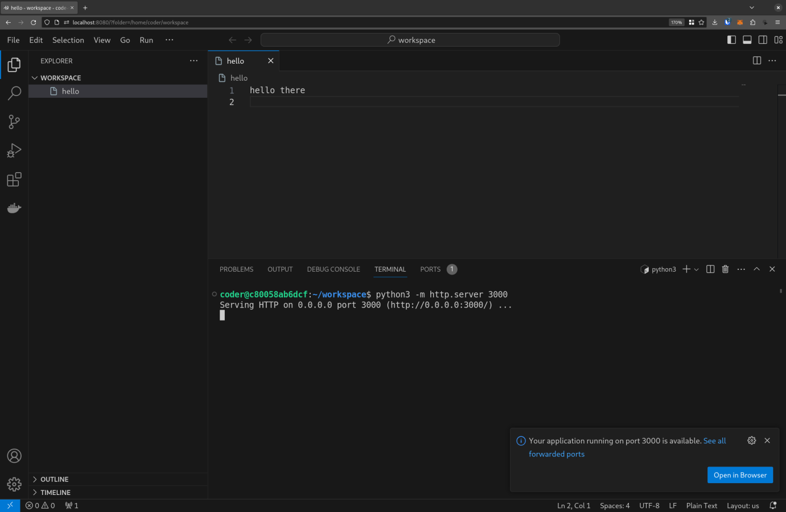
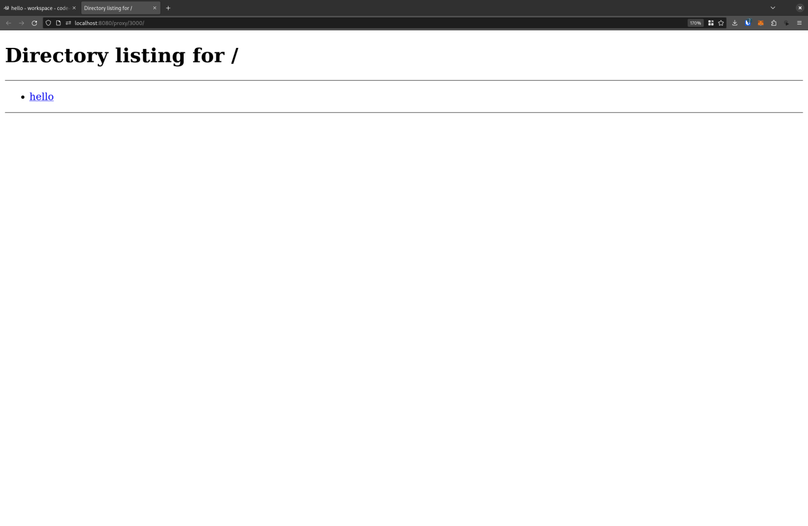

Custom VSCode server running in docker for quick linux environments. Based on Debian 11 and designed for CTFs.

## Running

This image requires the [sysbox](https://github.com/nestybox/sysbox) runtime.

```
docker run --rm --runtime=sysbox-runc -d -p 8080:8080 ghcr.io/cscosu/vs-workspace
```

Then navigate to http://localhost:8080.

## Preinstalled Tools

- Docker
- Python
  - [pwntools](https://github.com/Gallopsled/pwntools) pwn ctf framework
  - [pyshark](https://github.com/KimiNewt/pyshark) wireshark wrapper
  - [black](https://github.com/psf/black) formatter
- C/C++
  - [gef](https://github.com/hugsy/gef) gdb plugin
  - [clangd](https://clangd.llvm.org) language server
- JavaScript
  - [fnm](https://github.com/Schniz/fnm) node version manager
  - [bun](https://github.com/oven-sh/bun) javascript/typescript runtime
- \+ more

## HTTP Proxying

You can bring through HTTP servers from the container, without even bringing any ports through to the host.


